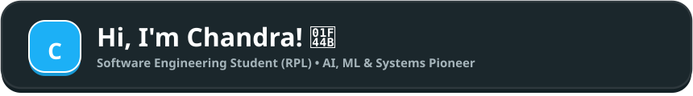
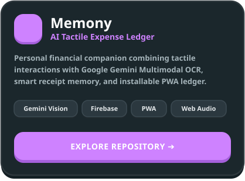
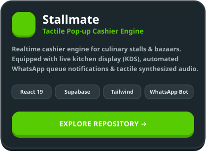
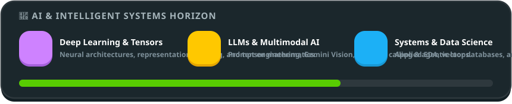

  <!-- Duolingo Tactile Hero Header -->
  

  <!-- 4 Chunky 3D Pushable Quick-Action Buttons -->
  

    
    &nbsp;
    
    &nbsp;
    
    &nbsp;
    
  

   

  <!-- Live Typing Terminal SVG -->
  

    
  

  

    <i>"Bridging intelligent algorithms with tactile, delightful human experiences. Dedicated to mastering full-spectrum engineering from systems architecture to multimodal AI."</i>
  

 

## 🚀 Featured Project Spotlight

<table border="0" width="100%">
  <tr>
    <td width="50%" align="center" style="border: none;">
      
    </td>
    <td width="50%" align="center" style="border: none;">
      
    </td>
  </tr>
</table>

 

## 🧠 AI & Intelligent Systems Horizon

  

 

## 🛠️ Technical Arsenal

<b>🧠 Artificial Intelligence & Data Science</b>

 

  
  
  
  
  
  
  

<b>🌐 Frontend & Modern Web Engineering</b>

 

  
  
  
  
  
  
  

<b>☁️ Backend, Realtime & Cloud Infrastructure</b>

 

  
  
  
  
  

<b>⚙️ Development Cockpit & Desktop</b>

 

  
  
  
  

 

## 🤝 Open Source & Collaborations

  <i>Belief in open craftsmanship and active community building. Open for collaborations on AI experiments, high-performance web systems, or developer tooling.</i>

 

## 📊 Activity & Live Metrics

  <table border="0">
    <tr>
      <td>
        
      </td>
      <td>
        
      </td>
    </tr>
  </table>

   

  

 

## 🐍 Contribution Graph Eater

  <picture>
    <source media="(prefers-color-scheme: dark)" srcset="https://raw.githubusercontent.com/channdraa-afk/channdraa-afk/output/github-contribution-grid-snake-dark.svg" />
    <source media="(prefers-color-scheme: light)" srcset="https://raw.githubusercontent.com/channdraa-afk/channdraa-afk/output/github-contribution-grid-snake.svg" />
    
  </picture>

 

---

  
<b>Let's build something extraordinary together!</b>

  
  

