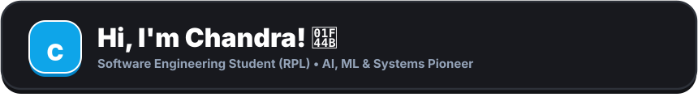
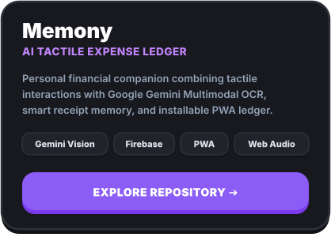
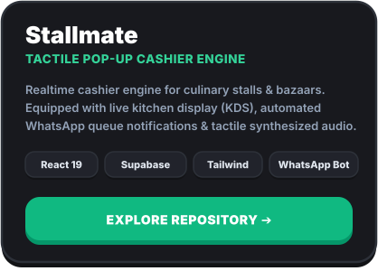
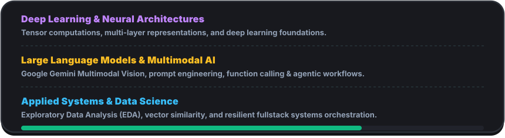
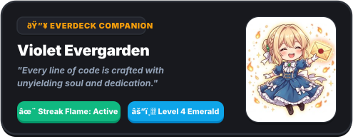

  <!-- Everdeck Tactile Hero Header (Adaptive Dual-Theme) -->
  <a href="https://github.com/channdraa-afk"><picture><source media="(prefers-color-scheme: dark)" srcset="assets/header-dark.svg" /><source media="(prefers-color-scheme: light)" srcset="assets/header-light.svg" /></picture></a>

  <!-- 4 Chunky 3D Pushable Quick-Action Buttons (Everdeck Palette) -->
  

    &nbsp;
    &nbsp;
    &nbsp;
    
  

   

  <!-- Live Typing Terminal SVG -->
  

    
  

  

    <i>"Bridging intelligent algorithms with tactile, delightful human experiences. Dedicated to mastering full-spectrum engineering from systems architecture to multimodal AI."</i>
  

 

<h2 id="featured-projects">🚀 Featured Project Spotlight</h2>

  <a href="https://github.com/channdraa-afk/Memony"><picture><source media="(prefers-color-scheme: dark)" srcset="assets/card-memony-dark.svg" /><source media="(prefers-color-scheme: light)" srcset="assets/card-memony-light.svg" /></picture></a>&nbsp;
  <a href="https://github.com/channdraa-afk/Stallmate"><picture><source media="(prefers-color-scheme: dark)" srcset="assets/card-stallmate-dark.svg" /><source media="(prefers-color-scheme: light)" srcset="assets/card-stallmate-light.svg" /></picture></a>

 

## 🧠 AI &amp; Intelligent Systems Horizon

  <picture>
    <source media="(prefers-color-scheme: dark)" srcset="assets/ai-spectrum-dark.svg" />
    <source media="(prefers-color-scheme: light)" srcset="assets/ai-spectrum-light.svg" />
    
  </picture>

 

<h2 id="tech-arsenal">🛠️ Technical Arsenal</h2>

<b>🧠 Artificial Intelligence &amp; Data Science</b>

 

  
  
  
  
  
  
  

<b>🌐 Frontend &amp; Modern Web Engineering</b>

 

  
  
  
  
  
  
  

<b>☁️ Backend, Realtime &amp; Cloud Infrastructure</b>

 

  
  
  
  
  

<b>⚙️ Development Cockpit &amp; Desktop</b>

 

  
  
  
  

 

## 🤝 Open Source &amp; Collaborations

  <i>Belief in open craftsmanship and active community building. Open for collaborations on AI experiments, high-performance web systems, or developer tooling.</i>

 

## 📊 Activity &amp; Live Metrics

  <a href="https://mail.google.com/mail/?view=cm&amp;fs=1&amp;to=chandradjhon@gmail.com&amp;su=Collaboration%20Inquiry%20-%20Chandra%20Portfolio" target="_blank"><picture><source media="(prefers-color-scheme: dark)" srcset="assets/card-companion-dark.svg" /><source media="(prefers-color-scheme: light)" srcset="assets/card-companion-light.svg" /></picture></a>&nbsp;
  <picture>
    <source media="(prefers-color-scheme: dark)" srcset="https://github-readme-streak-stats.herokuapp.com/?user=channdraa-afk&amp;theme=tokyonight&amp;hide_border=false&amp;border_color=2D3139&amp;background=18191E&amp;stroke=38BDF8&amp;ring=10B981&amp;fire=F59E0B&amp;currStreakLabel=10B981" />
    <source media="(prefers-color-scheme: light)" srcset="https://github-readme-streak-stats.herokuapp.com/?user=channdraa-afk&amp;theme=default&amp;hide_border=false&amp;border_color=E2E8F0&amp;background=FFFFFF&amp;stroke=0284C7&amp;ring=059669&amp;fire=D97706&amp;currStreakLabel=059669" />
    
  </picture>

  <picture>
    <source media="(prefers-color-scheme: dark)" srcset="https://github-readme-stats-eight-theta.vercel.app/api/top-langs/?username=channdraa-afk&amp;layout=compact&amp;theme=tokyonight&amp;hide_border=false&amp;border_color=2D3139&amp;bg_color=18191E&amp;title_color=38BDF8&amp;text_color=94A3B8" />
    <source media="(prefers-color-scheme: light)" srcset="https://github-readme-stats-eight-theta.vercel.app/api/top-langs/?username=channdraa-afk&amp;layout=compact&amp;theme=default&amp;hide_border=false&amp;border_color=E2E8F0&amp;bg_color=FFFFFF&amp;title_color=0284C7&amp;text_color=475569" />
    
  </picture>

 

## 🐍 Contribution Graph Eater

  <picture>
    <source media="(prefers-color-scheme: dark)" srcset="https://raw.githubusercontent.com/channdraa-afk/channdraa-afk/output/github-contribution-grid-snake-dark.svg" />
    <source media="(prefers-color-scheme: light)" srcset="https://raw.githubusercontent.com/channdraa-afk/channdraa-afk/output/github-contribution-grid-snake.svg" />
    
  </picture>

 

---

  
<b>Let's build something extraordinary together!</b>

  &nbsp;
  

